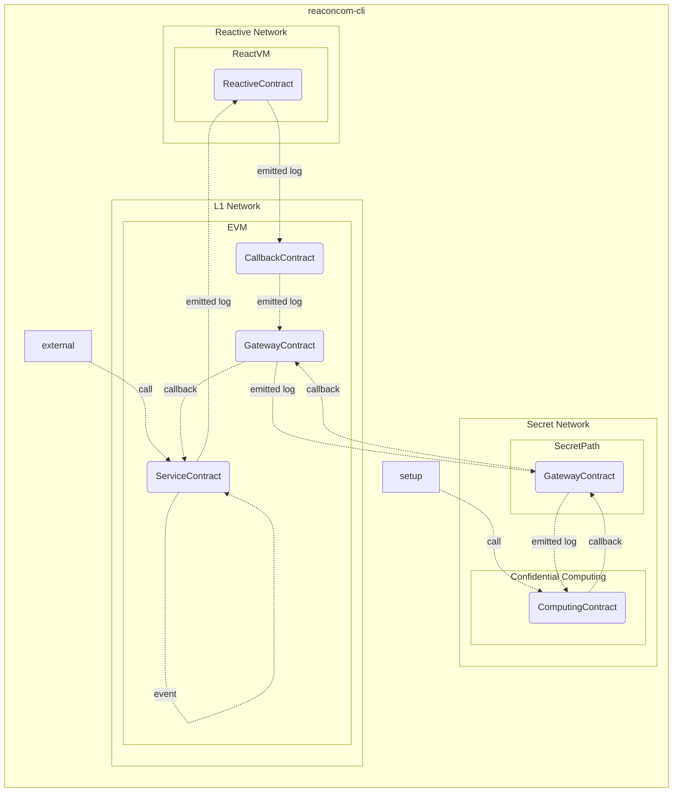
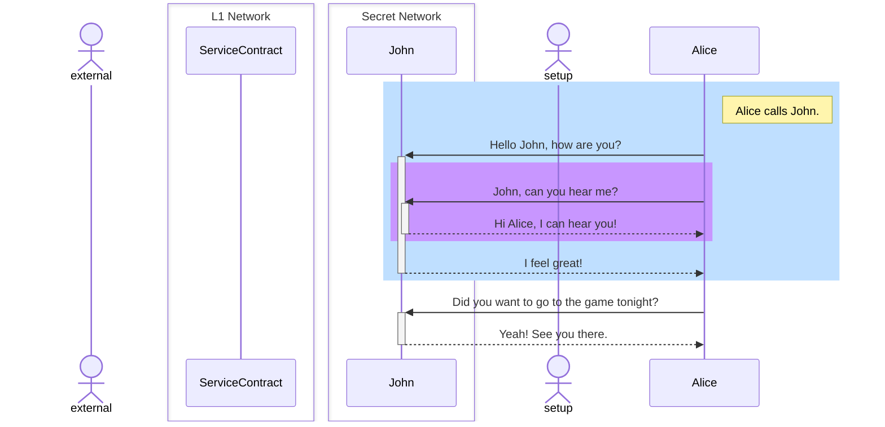

# Reaconcom [](https://github.com/ilyar/reactive-hackathon/actions/workflows/ci.yml)

**Rea**ctive **Con**fidential **Com**puting work fully on-chain and trusted execution environments (TEE) via Intel SGX





## Work in progress

- [x] gateway contract via Secret Network
- [ ] implement computing contract
- [x] implement destination contract
- [ ] implement reactive contract via Reactive Network
- [x] implement demo observed contract
- [ ] deploy demo case
- [ ] implement cli
- [ ] add usage description
- [x] add tests destination basic case
- [ ] add tests reactive basic case
- [ ] add tests demo case

## Usage

TBD

## Development

### Setup environment

```shell
curl -sSf https://sh.rustup.rs | sh
rustup target add wasm32-unknown-unknown
cargo install cargo-generate --features vendored-openssl
curl -L -o secretcli-Linux https://github.com/scrtlabs/SecretNetwork/releases/latest/download/secretcli-Linux
chmod +x secretcli-Linux
mv secretcli-Linux /usr/local/bin/secretcli
curl -sSf https://foundry.paradigm.xyz | sh
```

### Coding

```shell
make qa
make fmt
```

### Release

```shell
make release
```
